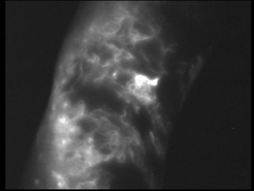
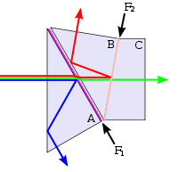
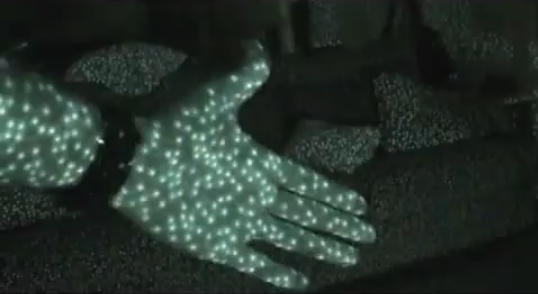
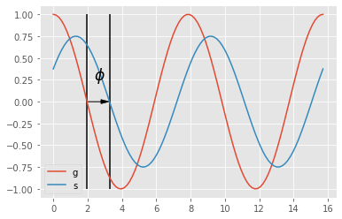

# Image Sensors

## Passive vs active imaging

* the object is the source of photon (SPECT, stars,...)
* the object reflects/react to light given by a external source (flash, fluorescence)
* the object is traversed by the ligh and diffuses/asborbes it (X-ray)

### Object as a source
Nuclear imaging is a good example of the first setup, here an injection of radio-tracer will accumulates to some region of interset (due to specific biochemical affinity). The following example shows how the radio-tracer identifies bone metastasis of a prostate cancer using a gamma camera.
    

[wikimedia commons](https://commons.wikimedia.org/wiki/File:Prostate-mets-102.jpg)

The source can also be the result of an external exitation i.e. an absorbtion and a re-emission of an other photon (fluorescence).

Fluorescence lymphography is an example of imaging using an external exitation, here, infrared light is used to exite fluorophore injected in the lymph system. Fluorophore can in turn re-emit infrared (at a longer wavelength). By using adapted filter, one can observe the lymph displacement inside the lymph network (close to the skin surface).
    

    
J.P.Belgrado

An other example, where fluorescence is used: the fluorescence microscopy.

### Object reflects / diffuses the light from an external source
This is the more common acquisition setup, external light source flood the scene with visible photons that are reflected by the objects, these photons are then acquired by a sensor.

### Object attenuates the source
Source and sensor can be placed on both side of the object being imaged, a good example is the X-Ray imaging, where a X-Ray source project photon trough a patient, these photon interact with the matter in such a way that tissue density and composition (bones vs soft tissues) can give a contrast variation at the sensor level.

[image source](https://en.wikipedia.org/wiki/X-ray#/media/File:Lung_X-ray.jpg)

## Direct image acquisition

### CCD - coupled charge device

Charges are liberated by light interaction with the semiconductor inside photoactive region, for each pixel of the sensor grid. In order to digitize the amount of charges (proportinal to light captured, CCD devices will move the charges along the substrate up to a charge to voltage converter.

Coupled Charge Device uses electrode potentials to move charges inside silicium substrate as illustrated bellow.

[wikimedia commons](https://commons.wikimedia.org/wiki/File:CCD_charge_transfer_animation.gif)

Image sensor can have essentially two types of geometry: 

* linear: typically used when the sensor is translated (flatbed scanner, but also bank note scanner, satellite, photo finish)
* rectangular: almost every other camera

In order to move charges along the dimensions of the CCD sensor, charges are moved along each image line, a perpendicular buffer is then used to discharge all these pixels in column into an amplifier that transform each charge into a voltage. The voltage is then converted by an ADC circuit. 

Because all the pixels charges are compared using the same circuit, the CCD sensor provide a very constant specification on the complete sensor. The other main advantage of the sensor is the coverage factor of the sensor (the ratio between the sensor surface and the total pixel surface), almost the surface is devoted to light acquisition (no extra circuitry needed).

    
[wikimedia commons](https://commons.wikimedia.org/wiki/File%3ACcd_schematic.JPG)
    

    

Linear CCD sensor.
[wikimedia commons](https://commons.wikimedia.org/wiki/File:CCD_line_sensor.JPG)

CCD line sensor in a ceramic dual in-line package. 
[wikimedia commons](https://commons.wikimedia.org/wiki/File:CCD_in_camera.jpg)

### CMOS

The CMOS technology embeds a photo-detector and a charge amplifier for each sensor pixel, the voltage being then transmitted by electrical conductors.

This strategy enables a greater variety of sensor usage, e.g. adressing a part of the sensor (for low resolution and higher speed).

Because the conversion is done separately for each pixels, no charge shifting is needed, but discrepency between charge amplifier may exist, giving unequal pixel sensitivity and noise.
    

    
[wikimedia commons](https://commons.wikimedia.org/wiki/File:CMOS_Image_Sensor_Mechanism_Illustration.svg)

###CMOS vs CCD

| feature             | CCD             | CMOS     |
|---------------------|-----------------|----------|
| Signal out of pixel | Electron packet | Voltage  |
| Fill factor         | high            | moderate |
| Amplifier mismatch  | none            | moderate |
| Noise               | low             | moderate |
| system complexity   | high            | low      |
| sensor complexity   | low             | high     |
| dynamic range       | high            | moderate |
| uniformity          | high            | moderate |
| speed               | moderate        | high     |

CMOS + CCD : high sensitivity to near infrared, therefore, most of the sensors are equiped with a NIR filter. 

[wikimedia commons](https://upload.wikimedia.org/wikipedia/commons/thumb/4/41/Response_silicon_photodiode.svg/544px-Response_silicon_photodiode.svg.png)

### Multispectral acquisition

Color acquisition is done by acquiring several images at different wavelength, one common (and cheap) approach is to cover sensors pixels by colored dyes (red, green and blue). The figure above illustrated such filters (bayer), where on each 2x2 pixel square, one pixel is sensitive to the red part of the spectrum, one to the blue part of the spectrum, and finally 2 pixels sensitive to the green part of the spectrum.

The choice of duplicating green is done for symetry purposes and also because the intensity sensitivity of the eye (see rods) is correlated to the green part of the spectrum.

[wiki commons](https://en.wikipedia.org/wiki/Bayer_filter#/media/File:Bayer_pattern_on_sensor.svg)

One limitation of the dye approach is the resolution limitation, indeed the image resolution is divided by 4.

The other method used is based on three CCD coupled on the same optical axis and having three different dyes (red, green, blue) as illustrated bellow.

[wikimedia commons](https://commons.wikimedia.org/wiki/File:Dichroic-prism.svg)

The big advantage of this approach is to keep the sensor native resolution for each color channel.

The number of spectral bands can be higher that three, for example satellite imagery offers many wavelength inside but also next to it (UV and near-IR).

Quick-bird (envionemental imagery,  pixel = 0.65m)
* Pan: 450-900 nm
* Blue: 450-520 nm
* Green: 520-600 nm
* Red: 630-690 nm
* Near IR: 760-900 nm

IKONOS (commercial earth observation satellite)

resolution

* 0.8 m panchromatic (1-m PAN)
* 4-meter multispectral (4-m MS)

spectrum

* Blue: 0.445–0.516 µm
* Green: 0.506–0.595 µm
* Red: 0.632–0.698 µm
* Near IR: 0.757–0.853 µm

Landsat 8 (American Earth observation satellite)

* Band 1 - Coastal / Aerosol	0.433 - 0.453 µm	30 m
* Band 2 - Blue	0.450 - 0.515 µm	30 m
* Band 3 - Green	0.525 - 0.600 µm	30 m
* Band 4 - Red	0.630 - 0.680 µm	30 m
* Band 5 - Near Infrared	0.845 - 0.885 µm	30 m
* Band 6 - Short Wavelength Infrared	1.560 - 1.660 µm	30 m
* Band 7 - Short Wavelength Infrared	2.100 - 2.300 µm	30 m
* Band 8 - Panchromatic	0.500 - 0.680 µm	15 m
* Band 9 - Cirrus	1.360 - 1.390 µm	30 m

AVIRIS - airborne visible/infrared imaging spectrometer 
* four linear spectrometers (614-pixel wide) / 224 adjacent spectral bands.

    
[wikimedia commons](https://commons.wikimedia.org/wiki/File:HyperspectralCube.jpg)

### Depth acquisition

Depth imaging is traditionnaly used in stereo application, such for robot vision.
Recently depth sensor became widely available thanks to game applications.The main technologies used are:
* stereovision 
* laser triangulation
* structured light projection
* Time-Of-Flight (TOF) imaging

The information provided by these sensors is of two types: a rgb image of the scene, and a depth estimation (usually at a coarser resolution).

example of a high resolution laser triangulation scanner:

    
When high speed is needed, structured light may be a solution.

For example, the first generation of the Kinect sensor uses the principe of structured light projection, a pseudo-random pattern is projected in the near-infrared spectrum(i.e. invible to human eye) and acquired by a IR sensitive camera. The depth image is produced with a video framerate compatible with gaming.

    
[wikimedia commons](https://commons.wikimedia.org/wiki/File:Xbox-360-Kinect-Standalone.png)

    
[image source](https://www.mattcutts.com/blog/open-kinect-contest/)

    
[image source](http://image-sensors-world.blogspot.be/2010_11_01_archive.html)

The depth is computed by triangulation thanks to the identification of specific pattern in the image.

The second generation of sensors is based on a completely different technology, the Time-Of-Flight (TOF). To estimate the distance between the sensor and the scene, a light wave is send and received by the sensor. The phase difference between a modulated light pattern sended by the source and the signal received by the camera gives a measure of the scene depth.

How to measure distance with light ?

[image source](http://www.laserfocusworld.com/articles/2011/01/lasers-bring-gesture-recognition-to-the-home.html)

Continuous wave demodulation

* retrieve phase shift by demodulation of the received signal
* demodulation by cross-correlation of the received signal with the emitted signal
* emitted signal is
$$g(t) = \cos(\omega t)$$ with $\omega$ the modulation frequency
* received signal after the return trip to the scene surface:
$$s(t) = b + a \cos(\omega t +\phi)$$ where $a$ is an unknown attenuation, $\phi$ the phase shift **i.e. a value proportional to the scene distance** and $b$ an unknown acquisition noise (neglected here).

    

* cross correlation of both emitted and received signal becomes:
$$ d(\tau) = s * g = \int_{-\inf}^{+\inf} s(t).g(t+\tau) dt$$ with $\tau$ an internal offset

$$ d(\tau) = \frac a 2 \cos(\omega t + \phi) + b $$

* sample $d(\tau)$ at 4 distinct moments (phase offsets):
$$A_i = d(i.\frac \pi 2)  \text{ with } i = 0,\dots, 3$$

    

* phase and attenuation are then:
$$ \phi = \arg \tan(\frac{A_3-A_1}{A_0-A_2}) $$
and
$$ a = \frac 1 2 \sqrt{(A_3-A_1)^2+(A_0-A_2)^2}$$
* scene distance is then:
$$dist = \frac{c}{4.\pi.\omega} \phi$$ where $c$ is the speed of light.

What a depth image looks like ?

[wikimedia commons](https://commons.wikimedia.org/wiki/File:TOF_Kamera_3D_Gesicht.jpg)

## Indirect image acquisition

Image can also be the result of a mathematical reconstruction based on an indirect acquisition, the sensor do not acquire an image directly.

For example, computed tomography, uses a series of 1D density profile acquisition enable a 2D reconstruction of the slice.
    

[image source]('http://130.237.83.53/medicaldevices/album/Ch%207%20Medical%20images/slides/F%207-10%20Computer%20tomography.jpg')

Echography is an other example of indirect imaging, where mechanical wave propagation are transformed in a 2D image showing the presence of interfaces between tissue of different acoustic impedence.

[wiki commons]('https://en.wikipedia.org/wiki/Medical_ultrasound#/media/File:Ultrasound_of_human_heart_apical_4-cahmber_view.gif')

other example: MRI image reconstruction

## Synthetic images

Image can also be the result of the grouping of a huge number of localized data, for example, one can imagine a network of temperature sensors spread over a complete contry, then the temperature measurements can be grouped on a 2D map (and interpolated to have a complete coverage).

Visualized data can be from various nature, the common aspect is that these data are placed in a geometric space (usually 2D or 3D). 

