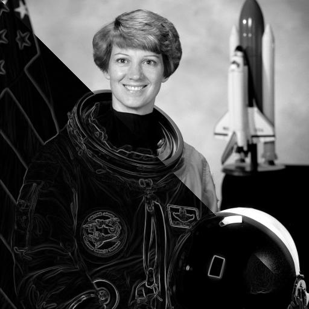

# INFO-H-500 Image acquisition and processing

{align=right}
## Objectives
After following this course one shouldbe able to understand different kind of images,
to analyse and decompose an image recognition problem into some basic steps,
to propose features to extract from the raw data for a given problem,
to implement an image processing chain using generic tools and specialized libraries.

More specificaly:

* Become familiar with basic numerical image processing
* Be able to recognize image properties
* Apply basic filtering and denoising
* Be able to segment an image using some of the classical methods

## Course content    	
* Introduction: examples of application of the image processing from several domains, medical applications, industry, HCI...
* Human vision fundamentals 
* Definitions : the image processing chain
* Quantification : spatial, spectral and intensity color representation different acquisition modalities sensor,sensor+source,...
* Acquisition devices : CCD, CMOS, time-of-flight (TOF)
* Notions of compression : run-length-coding, hierarchical decomposition, Jpeg lossy compression
* Pre-processing - Histogram based image enhancement
* Linear filtering Fourier transform
* Fourier domain processing : e.g. interlaced image correction pattern matching
* Image restoration 
* Morphomatematics definitions : ensemble, structuring element
* Basic operators : erosion, dilation, duality combined operators : opening, closing
* Gray-level morphology watershed transform
* Segmentation/ object detection pixel based : threshold : optimal, Otsu
* Color segmentation border based: gradient, Laplacian, LoG
* Region based : split and merge, watershed(recall) mean-shift
* Hough transform
* Object description binary, image labelling, chain code, polygonal approximation, Fourier descriptors, invariant moments, convexity, fractal dimension, texture

## Laboratories

In parallel to the lectures, a serie of labs are is organized. 
The student are invited to reuse lecture material given as Jupyter Python Notebooks during the laboratory.

[go to the LAB page](labs.md) 

